#  Ant Design of React学习

`antd`是基于Ant Design设计体系的React UI组件库，主要用于研发企业级中后台产品。


## ✨ 特性[#](https://ant.design/docs/react/introduce-cn#✨-特性)

- 🌈 提炼自企业级中后台产品的交互语言和视觉风格。
- 📦 开箱即用的高质量 React 组件。
- 🛡 使用 TypeScript 开发，提供完整的类型定义文件。
- ⚙️ 全链路开发和设计工具体系。
- 🌍 数十个国际化语言支持。
- 🎨 深入每个细节的主题定制能力。


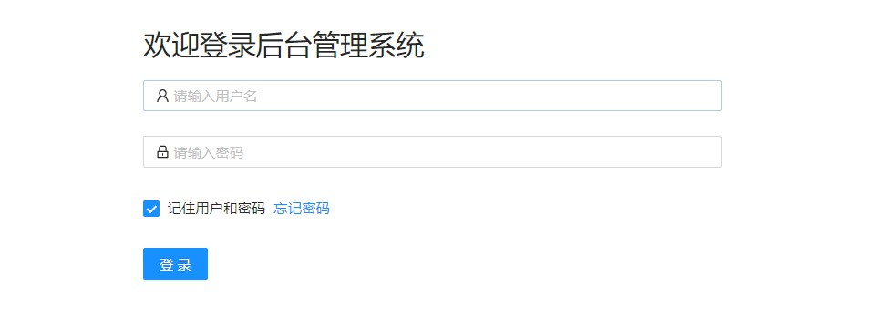

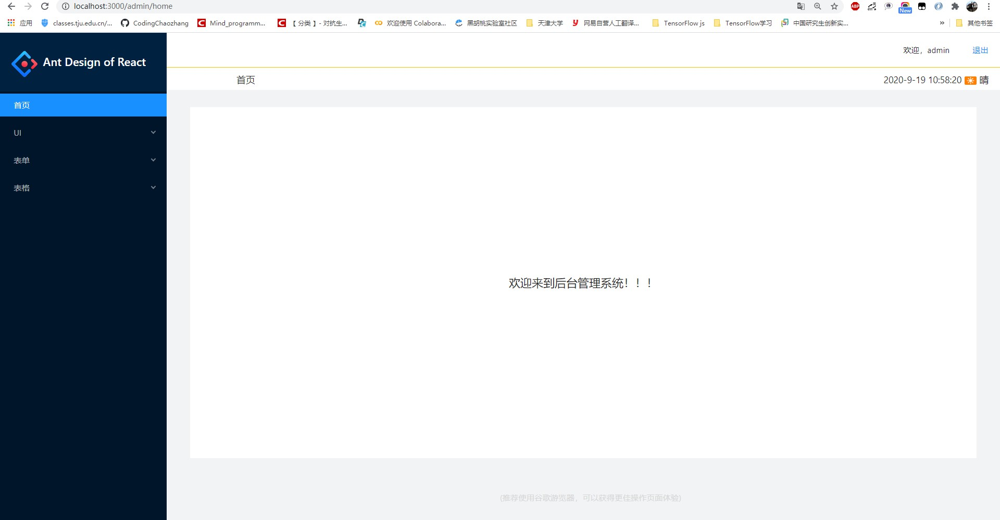


## 一、准备React模板

本次基于[10分钟快速搭建React后台管理系统模板](https://blog.csdn.net/Mind_programmonkey/article/details/108615870)  其[源码地址](https://github.com/CodingChaozhang/react_management_template/tree/master/react_management_system_template)


在上述源码的基础上，对`src/config/menuConfig.js`进行修改，

```js
const menuList = [
    {
        title: '首页',
        key: '/admin/home'
    },
    {
        title: 'UI',
        key: '/admin/ui',
        children: [
            {
                title: '按钮',
                key: '/admin/ui/buttons',
            },
            {
                title: '弹框',
                key: '/admin/ui/modals',
            },
            {
                title: 'Loading',
                key: '/admin/ui/loadings',
            },
            {
                title: '通知提醒',
                key: '/admin/ui/notification',
            },
            {
                title: '全局Message',
                key: '/admin/ui/messages',
            },
            {
                title: 'Tab页签',
                key: '/admin/ui/tabs',
            },
            {
                title: '图片画廊',
                key: '/admin/ui/gallery',
            },
            {
                title: '轮播图',
                key: '/admin/ui/carousel',
            }
        ]
    },
    {
        title: '表单',
        key: '/admin/form',
        children: [
            {
                title: '登录',
                key: '/admin/form/login',
            },
            {
                title: '注册',
                key: '/admin/form/reg',
            }
        ]
    },
    {
        title: '表格',
        key: '/admin/table',
        children: [
            {
                title: '基础表格',
                key: '/admin/table/basic',
            },
            {
                title: '高级表格',
                key: '/admin/table/high',
            }
        ]
    }
];
export default menuList;
```


## 二、Ant-UI组件学习

### 2.1 按钮组件

- 基础按钮
- 图形按钮
- Loading按钮
- 按钮组
- 按钮尺寸


```js
import React from 'react';
import {Row,Radio,Card,Button} from 'antd';
import './index.less';
import { PlusOutlined,EditOutlined,DeleteOutlined,DownloadOutlined,SearchOutlined,LeftOutlined,RightOutlined } from '@ant-design/icons';

class index extends React.Component {
    constructor(props) {
        super(props);
        this.state = { 
            loading:true,
            size:"default"
         };
    }

    handleCloseLoading=()=>{
        this.setState({
            loading:false
        })
    }
    handleChange=(e)=>{
        this.setState({
            size:e.target.value
        })
    }
    render() {
        return (
            <div>
                <Row>
                    <Card title="基础按钮" className="base_button" >
                        <Button type="primary">按钮</Button>
                        <Button>按钮</Button>
                        <Button type="dashed">按钮</Button>
                        <Button type="danger">按钮</Button>
                        <Button disabled>按钮</Button>
                    </Card>

                    <Card title="图形按钮" className="base_button" >
                        <Button icon={<PlusOutlined />}>创建</Button>
                        <Button icon={<EditOutlined />}>编辑</Button>
                        <Button icon={<DeleteOutlined />}type="dashed">删除</Button>
                        <Button icon={<SearchOutlined />} type="primary">搜索</Button>
                        <Button icon={<DownloadOutlined />}  type="primary">下载</Button>
                    </Card>


                    <Card title="Loading按钮" className="base_button" >
                        <Button type="primary" loading={this.state.loading}>确定</Button>
                        <Button type="primary" shape="circle" loading={this.state.loading}></Button>
                        <Button loading={this.state.loading}>点击加载</Button>
                        <Button shape="circle" loading={this.state.loading}></Button>
                        <Button type="primary" onClick={this.handleCloseLoading}>关闭</Button>
                    </Card>

                    <Card title="按钮组" className="base_button" >
                        <Button.Group>
                            <Button type="primary" icon={<LeftOutlined/>}>返回</Button>
                            <Button  type="primary" icon={<RightOutlined/>}>前进</Button>
                        </Button.Group>
                    </Card>


                    <Card title="按钮尺寸" className="base_button" >
                        <Radio.Group value={this.state.size} onChange={this.handleChange}>
                            <Radio value="small">小</Radio>
                            <Radio value="default">中</Radio>
                            <Radio value="large">大</Radio>
                        </Radio.Group>

                        <Button size={this.state.size} type="primary">按钮</Button>
                        <Button size={this.state.size} >按钮</Button>
                        <Button size={this.state.size} type="dashed">按钮</Button>
                        <Button size={this.state.size} type="danger">按钮</Button>
                        <Button size={this.state.size} disabled>按钮</Button>
                    </Card>
                </Row>
            </div>
        );
    }
}

export default index;
```

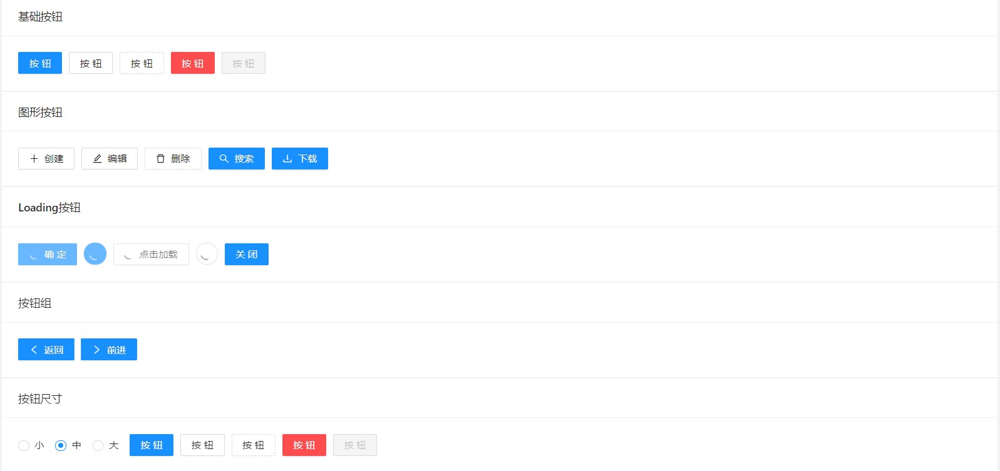

### 2.2 弹框

- 基础模态框
- 信息确定框

```js
import React from 'react';
import {Row,Modal,Card,Button} from 'antd';
import './index.less';

class index extends React.Component {
    constructor(props) {
        super(props);
        this.state = {
            showModal1:false,
            showModal2:false,
            showModal3:false,
            showModal4:false
          };
    }
    handleOpen=(type)=>{
        this.setState({
            [type]:true
        })
    }

    handleConfirm=(type)=>{
        Modal[type]({
            title:"确定？",
            content:"你确定你学会React了吗？",
            onOk(){
                console.log("OK")
            },
            onCancel(){
                console.log("Cancel")
            }
        })
    }
    render() {
        return (
            <Row>
                <Card title="基础模态框" className="card-wrap">
                    <Button type="primary" onClick={()=>this.handleOpen("showModal1")}>Open</Button>
                    <Button type="primary" onClick={()=>this.handleOpen("showModal2")}>自定义页脚</Button>
                </Card>
                
                <Card title="信息确认框" className="card-wrap">
                    <Button type="primary" onClick={()=>this.handleConfirm("confirm")}>Confirm</Button>
                    <Button type="primary" onClick={()=>this.handleConfirm("info")}>Info</Button>
                    <Button type="primary" onClick={()=>this.handleConfirm("success")}>Success</Button>
                    <Button type="primary" onClick={()=>this.handleConfirm("warning")}>Warning</Button>

                </Card>

                <Modal title="antd" visible={this.state.showModal1} onCancel={()=>{
                    this.setState({
                        showModal1:false
                    })
                }} >
                    <p>Antd Design of React 之弹窗学习</p>
                </Modal>

                <Modal title="antd" okText={"好了"} cancelText={"算了"} visible={this.state.showModal2} onCancel={()=>{
                    this.setState({
                        showModal2:false
                    })
                }} >
                    <p>Antd Design of React 之弹窗学习</p>
                </Modal>
            </Row>
        );
    }
}

export default index;
```


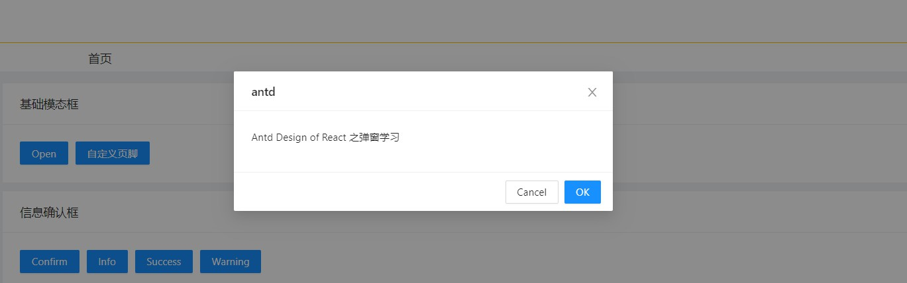

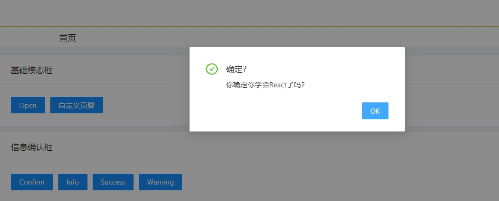

### 2.3 Loading

- Spin的用法
- 内容Loading...

```js
import React from 'react';
import {Row,Modal,Card,Button,Spin, Alert} from 'antd';
import './index.less';

class index extends React.Component {
    constructor(props) {
        super(props);
        this.state = { 

         };
    }
    render() {
        return (
            <Row>
                <Card title="Spin的用法" className="card-wrap">
                    <Spin size="small"/>
                    <Spin/>
                    <Spin size="large"/>
                </Card>

                <Card title="内容遮罩" className="card-wrap">
                    <Alert  message="React" description="Antd Pro Design of React教程学习" type="info">
                    </Alert>

                    <Alert  message="React" description="Antd Pro Design of React教程学习" type="warning">
                    </Alert>

                    <Spin tip="加载中">
                        <Alert  message="React" description="Antd Pro Design of React教程学习" type="warning">
                        </Alert>
                    </Spin>
                </Card>
            </Row>
        );
    }
}

export default index;
```

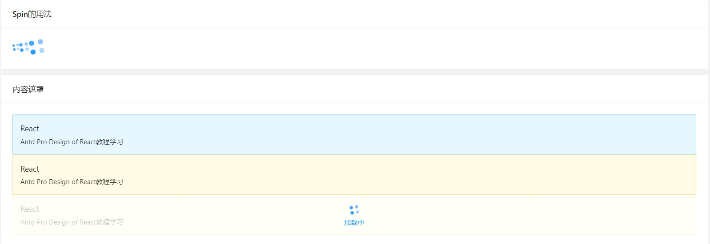

### 2.4 通知提醒

```js
import React from 'react';
import {Row,Modal,Card,Button,notification} from 'antd';
import './index.less';

class index extends React.Component {
    constructor(props) {
        super(props);
        this.state = { 

         };
    }
    handleNotice=(type,direction)=>{
        if(direction){
            notification.config({
                placement:direction
            })
        }
        notification[type]({
            message:"天气播报",
            description:"今天晴转多云，温度28度，注意保暖！！！"
        });
    }

    render() {
        return (
            <div>
                <Row>
                    <Card title="消息通知框" className="card-wrap">
                        <Button type="primary" onClick={()=>this.handleNotice("success")}>success</Button>
                        <Button type="primary" onClick={()=>this.handleNotice("info")}>info</Button>
                        <Button type="primary" onClick={()=>this.handleNotice("warning")}>warning</Button>
                        <Button type="primary" onClick={()=>this.handleNotice("error")}>error</Button>
                    </Card>

                    <Card title="消息通知框的出现位置" className="card-wrap">
                        <Button type="primary" onClick={()=>this.handleNotice("success","topLeft")}>success</Button>
                        <Button type="primary" onClick={()=>this.handleNotice("info","topRight")}>info</Button>
                        <Button type="primary" onClick={()=>this.handleNotice("warning","bottomLeft")}>warning</Button>
                        <Button type="primary" onClick={()=>this.handleNotice("error","bottomRight")}>error</Button>
                    </Card>
                </Row>
            </div>
        );
    }
}

export default index;
```


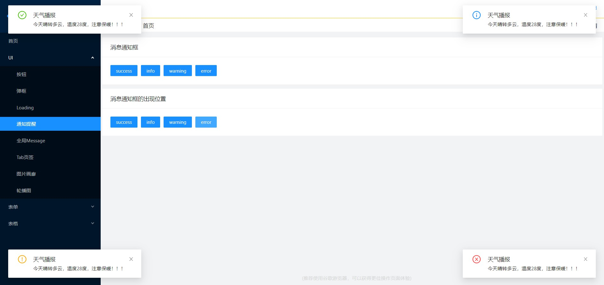


### 2.5 全局Message

```js
import React from 'react';
import {Row,Modal,Card,Button,message, Alert} from 'antd';
import './index.less';

class index extends React.Component {
    constructor(props) {
        super(props);
        this.state = {  };
    }

    onMessage=(type)=>{
        message[type]({
            content:"恭喜你中了500万"
        })
    }


    render() {
        return (
            <div>
                <Row>
                    <Card title="全局Message提示框的用法" className="card-wrap">
                        <Button type="primary" onClick={()=>this.onMessage("success")}>success</Button>
                        <Button type="primary" onClick={()=>this.onMessage("info")}>info</Button>
                        <Button type="primary" onClick={()=>this.onMessage("warning")}>warning</Button>
                        <Button type="primary" onClick={()=>this.onMessage("error")}>error</Button>
                        <Button type="primary" onClick={()=>this.onMessage("loading")}>loading</Button>
                    </Card>
                </Row>
            </div>
        );
    }
}

export default index;
```


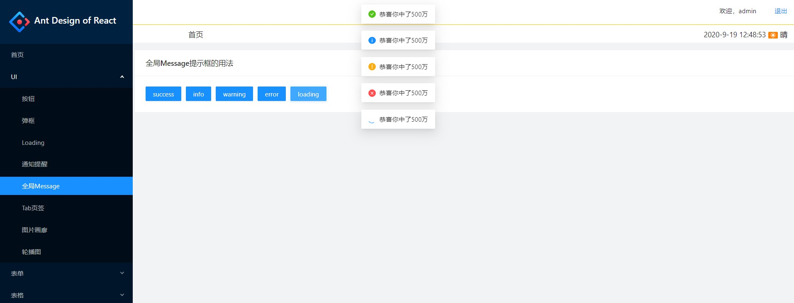

### 2.6 Tab页签

- 基础Tab演示

- Tab带图标演示

- Tab带增删的页签

```js
import React from 'react';
import {Row,Tabs,Card,Button,message} from 'antd';
import './index.less';
import { PlusOutlined,EditOutlined,DeleteOutlined,DownloadOutlined,SearchOutlined,LeftOutlined,RightOutlined } from '@ant-design/icons';

const {TabPane} = Tabs;


class index extends React.Component {
    constructor(props) {
        super(props);
        this.state = { 
           
         };
    }
    newTabIndex = 0;
    handleCallback = (key)=>{
        message.info("Hi,您选择了页签："+key)
    }
    componentWillMount(){
        const panes = [
            {
                title:'Tab 1',
                content: 'Tab 1',
                key:'1'
            },
            {
                title: 'Tab 2',
                content: 'Tab 2',
                key: '2'
            },
            {
                title: 'Tab 3',
                content: 'Tab 3',
                key: '3'
            }
        ]
        this.setState({
            activeKey: panes[0].key,
            panes
        })
    }
    onChange = (activeKey)=>{
        this.setState({
            activeKey
        })
    }

    onEdit = (targetKey, action) => {
        this[action](targetKey);
    }

    add = () => {
        const panes = this.state.panes;
        const activeKey = `newTab${this.newTabIndex++}`;
        panes.push({ title: activeKey, content: 'New Tab Pane', key: activeKey });
        this.setState({ panes, activeKey });
    }
    remove = (targetKey) => {
        let activeKey = this.state.activeKey;
        let lastIndex;
        this.state.panes.forEach((pane, i) => {
            if (pane.key === targetKey) {
                lastIndex = i - 1;
            }
        });
        const panes = this.state.panes.filter(pane => pane.key !== targetKey);
        if (lastIndex >= 0 && activeKey === targetKey) {
            activeKey = panes[lastIndex].key;
        }
        this.setState({ panes, activeKey });
    }

    render() {
        return (
            <div>
                <Row>
                    <Card title="Tab基础演示" className="base_button" >
                        <Tabs>
                            <TabPane tab="tab1" key="1">
                                content of tabl
                            </TabPane>
                            
                            <TabPane tab="tab2" key="2">
                                content of tab2
                            </TabPane>

                            <TabPane tab="tab3" key="3">
                                content of tab3
                            </TabPane>
                        </Tabs>
                    </Card>


                    <Card title="Tab带图标演示" className="base_button" >
                        <Tabs>
                            <TabPane tab={<span><PlusOutlined/>"tab1"</span>} key="1">
                                content of tabl
                            </TabPane>
                            
                            <TabPane tab={<span><EditOutlined/>"tab2"</span>} key="2">
                                content of tab2
                            </TabPane>

                            <TabPane tab={<span><DeleteOutlined/>"tab3"</span>} key="3">
                                content of tab3
                            </TabPane>
                        </Tabs>
                    </Card>


                    <Card title="Tab带图的页签" className="card-wrap">
                    <Tabs 
                        onChange={this.onChange}
                        activeKey={this.state.activeKey}
                        type="editable-card"
                        onEdit={this.onEdit}
                    >
                        {
                            this.state.panes.map((panel)=>{
                                return <TabPane 
                                    tab={panel.title}
                                    key={panel.key}

                                />
                            })
                        }
                    </Tabs>
                </Card>

                </Row>
            </div>
        );
    }
}

export default index;
```

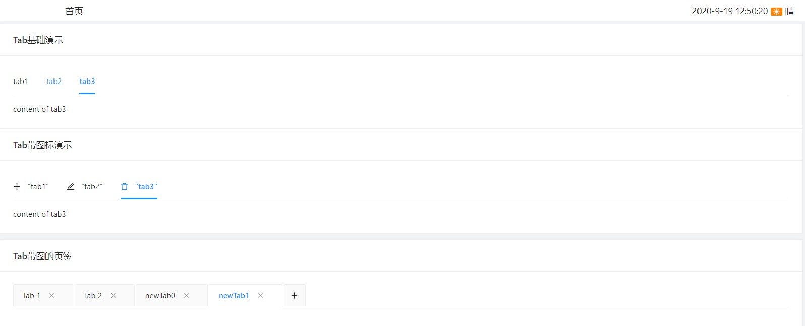

### 2.7 图片画廊

```js
import React from 'react';
import {Card,Row,Col,Modal} from 'antd';

class index extends React.Component {
    constructor(props) {
        super(props);
        this.state = { 
            visible:false
         };
    }
    openGallery=(imgSrc)=>{
        this.setState({
            visible:true,
            currentImg:'/gallery/' + imgSrc
        })
    }

    render() {
        const imgs = [
            ['1.png','2.png','3.png','4.png','5.png'],
            ['6.png','7.png','8.png','9.png','10.png'],
            ['11.png','12.png','13.png','14.png','15.png'],
            ['16.png','17.png','18.png','19.png','20.png'],
            ['21.png','22.png','23.png','24.png','25.png'],
        ];
        const imgList = imgs.map((list)=>list.map((item)=>
            <Card style={{marginBottom:10}} cover={this.openGallery(item)}/>}>
                <Card.Meta title="React Admin" description="Antd">

                </Card.Meta>
            </Card>
        ));

        return (
            <div className="card-wrap">
                <Row gutter={10}>
                    <Col md={5}>
                        {imgList[0]}
                    </Col>
                    <Col md={5}>
                        {imgList[1]}
                    </Col>
                    <Col md={5}>
                        {imgList[2]}
                    </Col>
                    <Col md={5}>
                        {imgList[3]}
                    </Col>
                    <Col md={4}>
                        {imgList[4]}
                    </Col>
                </Row>

                <Modal width={300} height={500} visible={this.state.visible} title="图片画廊" onCancel={()=>{
                    this.setState({
                        visible:false
                    })
                }} footer={null}>
                    {}
                </Modal>
            </div>
        );
    }
}

export default index;
```


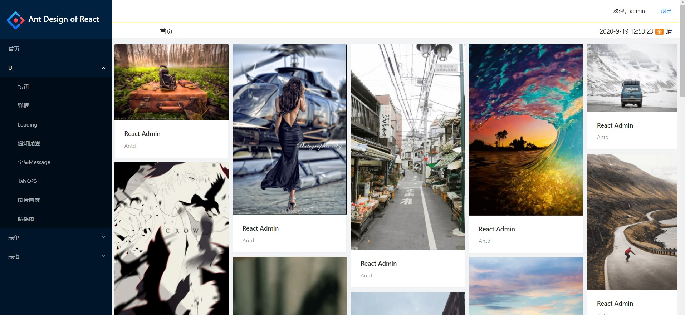

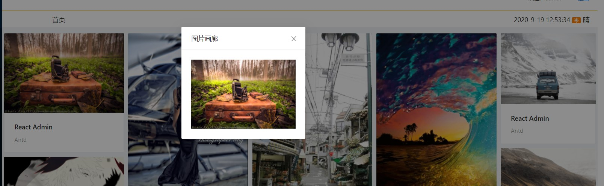

### 2.8 轮播图

- 文字背景轮播
- 图片轮播

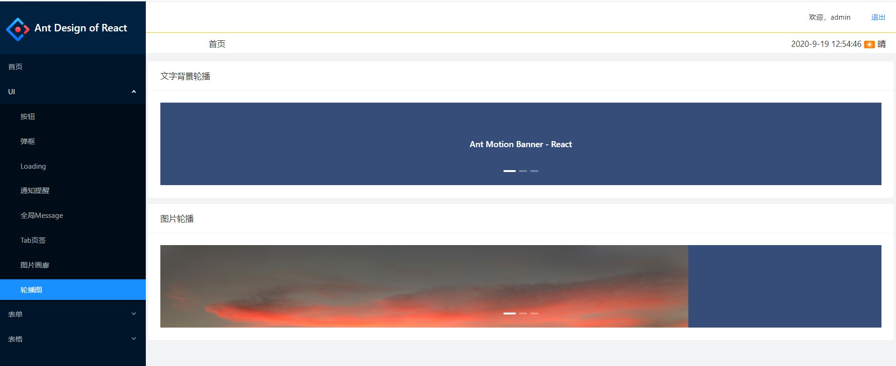

```js
import React from 'react';
import {Card,Row,Col,Carousel} from 'antd';
import './index.less';

class index extends React.Component {
    constructor(props) {
        super(props);
        this.state = {  };
    }
    render() {
        return (
            <div>
                <Card title="文字背景轮播" className="card-wrap">
                    <Carousel autoplay effect="fade">
                        <div><h3>Ant Motion Banner - React</h3></div>
                        <div><h3>Ant Motion Banner - Vue</h3></div>
                        <div><h3>Ant Motion Banner - Angular</h3></div>
                    </Carousel>
                </Card>

                <Card title="图片轮播" className="card-wrap">
                    <Carousel autoplay effect="fade">
                        <div>
                            
                        </div>
                        <div>
                            
                        </div>
                        <div>
                            
                        </div>
                    </Carousel>
                </Card>
            </div>
        );
    }
}

export default index;
```


## 三、Ant-表单组件学习

### 3.1 登录

- 内联表单
- 外联表单

```js
import React from 'react';
import { Form, Input, Button, Checkbox,Card } from 'antd';
import { UserOutlined, LockOutlined } from '@ant-design/icons';
import './index.less';

class index extends React.Component {
    constructor(props) {
        super(props);
        this.state = { 
            username:'',
            password:''
         };
    }

    onInputChange=(e)=>{
        let inputname = e.target.name;
        let inputvalue = e.target.value;
        this.setState({
            [inputname]:inputvalue
        })
    }

    onhandleSubmit=()=>{
        console.log(this.state.username,this.state.password)
    }

    render() {
        return (
            <div>
                <Card title="内敛表单" className="card-wrap-login">
                    <Form  name="horizontal_login" layout="inline">
                        <Form.Item name="username" rules={[{ required: true, message: 'Please input your username!' }]}>
                            <Input prefix={<UserOutlined className="site-form-item-icon" />} placeholder="用户名" />
                        </Form.Item>
                        <Form.Item name="password" rules={[{ required: true, message: 'Please input your password!' }]}>
                            <Input prefix={<LockOutlined className="site-form-item-icon" />} type="password" placeholder="密码"/>
                        </Form.Item>
                        <Form.Item>
                            <Button type="primary" htmlType="submit">
                                登录
                            </Button>
                        </Form.Item>
                    </Form>
                </Card>
                <Card title="外联表单" className="card-wrap">
                    <Form name="normal_login" className="login-form" initialValues={{ remember: true }}>
                        <Form.Item  rules={[{ required: true, message: '请输入用户名！！！' }]}>
                            <Input name="username" prefix={<UserOutlined className="site-form-item-icon" />} placeholder="请输入用户名" onChange={this.onInputChange} />
                        </Form.Item>
                        <Form.Item rules={[{ required: true, message: '请输入密码！！！' }]}>
                            <Input name="password" prefix={<LockOutlined className="site-form-item-icon" />} type="password" placeholder="请输入密码" onChange={this.onInputChange}/>
                        </Form.Item>
                        <Form.Item>
                            <Form.Item name="remember" valuePropName="checked" noStyle>
                                <Checkbox>记住密码</Checkbox>
                            </Form.Item>
                            <a className="login-form-forgot" href="">
                                忘记密码
                            </a>
                        </Form.Item>
                        <Form.Item>
                            <Button type="primary" htmlType="submit" className="login-form-button" onClick={this.onhandleSubmit}>
                             登录
                            </Button>
                        
                        </Form.Item>
                    </Form>
                </Card>
            </div>
        );
    }
}

export default index;
```

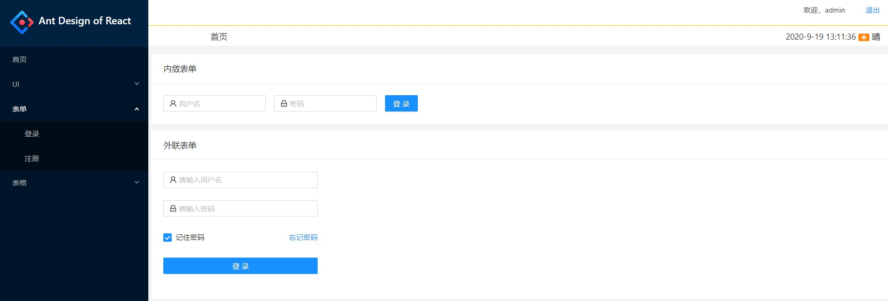

### 3.2 注册

```js
import React from 'react';
import { Form, Input, Button, Checkbox,Card,Radio,InputNumber,Select,Switch,DatePicker,Upload } from 'antd';
import { UserOutlined, LockOutlined,LoadingOutlined, PlusOutlined} from '@ant-design/icons';
import './index.less';

class index extends React.Component {
    constructor(props) {
        super(props);
        this.state = { 

         };
    }

    getBase64=(img, callback)=> {
        const reader = new FileReader();
        reader.addEventListener('load', () => callback(reader.result));
        reader.readAsDataURL(img);
    }

    handleChange = info => {
        if (info.file.status === 'uploading') {
          this.setState({ loading: true });
          return;
        }
        if (info.file.status === 'done') {
          // Get this url from response in real world.
          this.getBase64(info.file.originFileObj, imageUrl =>
            this.setState({
              userImg:imageUrl,
              loading: false,
            }),
          );
        }
    };

    render() {
        const formItemLayout = {
            labelCol: { span: 8 },
            wrapperCol: { span: 16 },
          };

        const offsetLayout={
            wrapperCol:{
                xs:24,
                sm:{
                    span:16,
                    offset:6
                }
            }
        }
        
        const RadioGroup = Radio.Group;
        const { Option } = Select;
        const TextArea = Input.TextArea;
 
        

        return (
            <div>
                <Card title="注册表单" className="card-wrap">
                    <Form name="normal_login" className="login-form" initialValues={{ remember: true }}>
                            <Form.Item {...formItemLayout} name="username" label="用户名" rules={[{ required: true, message: '请输入用户名！！！' }]}>
                                <Input name="username" prefix={<UserOutlined className="site-form-item-icon" />} placeholder="请输入用户名" onChange={this.onInputChange} />
                            </Form.Item>
                            <Form.Item {...formItemLayout} name="password" label="密码" rules={[{ required: true, message: '请输入密码！！！' }]}>
                                <Input name="password" prefix={<LockOutlined className="site-form-item-icon" />} type="password" placeholder="请输入密码" onChange={this.onInputChange}/>
                            </Form.Item>

                            <Form.Item {...formItemLayout} name="sex" label="性别" rules={[{ required: true }]}>
                                <RadioGroup defaultValue="1">
                                    <Radio value="1">男</Radio>
                                    <Radio value="2">女</Radio>
                                </RadioGroup>
                            </Form.Item>

                            <Form.Item {...formItemLayout} name="age" label="年龄" rules={[{ required: true }]}>
                                <InputNumber min={1} max={100} defaultValue={18}/>
                            </Form.Item>

                            <Form.Item {...formItemLayout} name="state"  label="状态" rules={[{ required: true }]}>
                                <Select defaultValue="3">
                                    <Option value="1">上学</Option>
                                    <Option value="2">工作</Option>
                                    <Option value="3">财富自由</Option>
                                </Select>
                            </Form.Item>
                            
                            <Form.Item {...formItemLayout} name="hobby"  label="爱好" rules={[{ required: true }]}>
                                <Select mode="multiple" defaultValue="4">
                                    <Option value="1">游泳</Option>
                                    <Option value="2">打篮球</Option>
                                    <Option value="3">踢足球</Option>
                                    <Option value="4">跑步</Option>
                                    <Option value="5">爬山</Option>
                                    <Option value="6">骑行</Option>
                                    <Option value="7">桌球</Option>
                                    <Option value="8">麦霸</Option>
                                </Select>
                            </Form.Item>

                            <Form.Item {...formItemLayout} name="is_married" label="是否已婚">
                               <Switch defaultChecked/>
                            </Form.Item>

                            <Form.Item {...formItemLayout} name="time" label="生日">
                                <DatePicker showTime format="YYYY-MM-DD HH:mm:ss"/>
                            </Form.Item>

                            <Form.Item {...formItemLayout} name="address" label="地址">
                               <TextArea/>
                            </Form.Item>


                            <Form.Item {...formItemLayout} name="icon" label="头像">
                                <Upload
                                    name="avatar"
                                    listType="picture-card"
                                    className="avatar-uploader"
                                    showUploadList={false}
                                    action="https://www.mocky.io/v2/5cc8019d300000980a055e76"
                                    onChange={this.handleChange}
                                >
                                {this.state.userImg ?  : <PlusOutlined />}
                                </Upload>
                            </Form.Item>

                            <Form.Item {...offsetLayout} name="xieyi" >
                                <Checkbox>我已阅读过<a href="#">协议</a></Checkbox>
                            </Form.Item>

                            <Form.Item {...offsetLayout} name="register" >
                               <Button type="primary" >注册 </Button>
                            </Form.Item>

                        </Form>
                </Card>
            </div>
        );
    }
}

export default index;
```


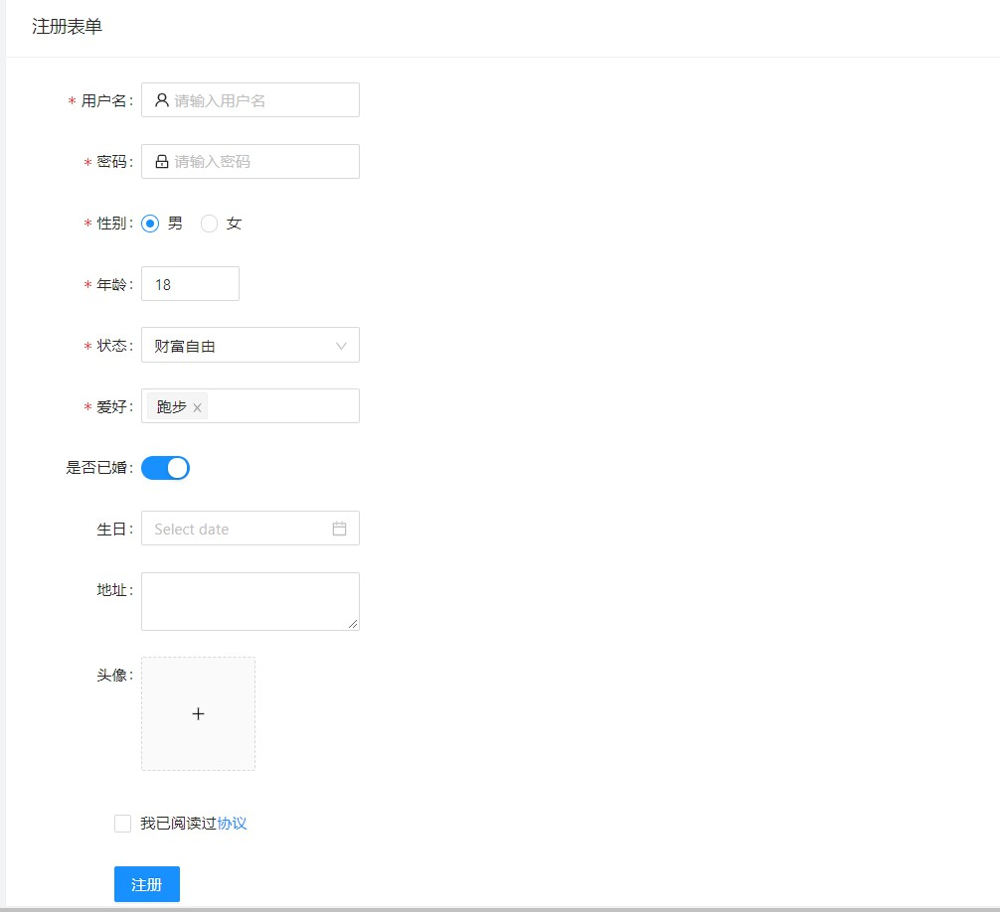


## 四、Ant-表单学习

### 4.1 基础表格

- 基础表格
- 动态表格渲染
- 动态表格嵌套单选按钮
- 动态表格嵌套多选按钮
- 动态表格分页功能

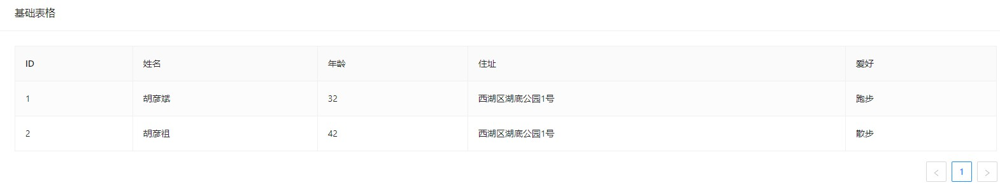

 

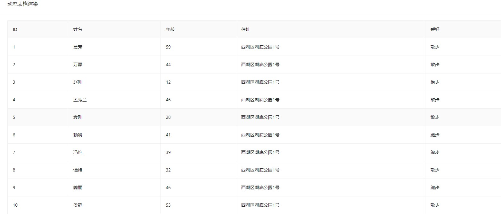


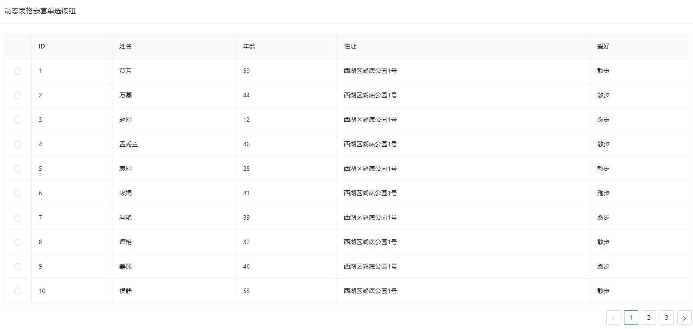

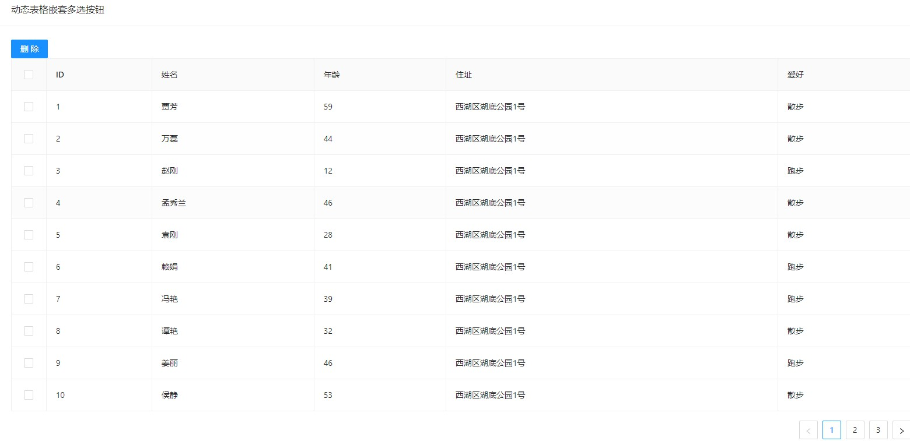

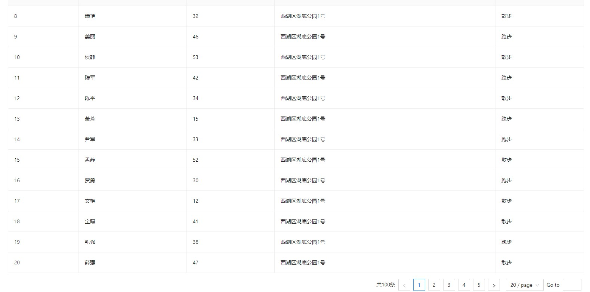


### 4.2 高级表格

- 高级表格-表头固定
- 高级表格-列固定
- 高级表格-列排序
- 高级表格-按钮嵌套

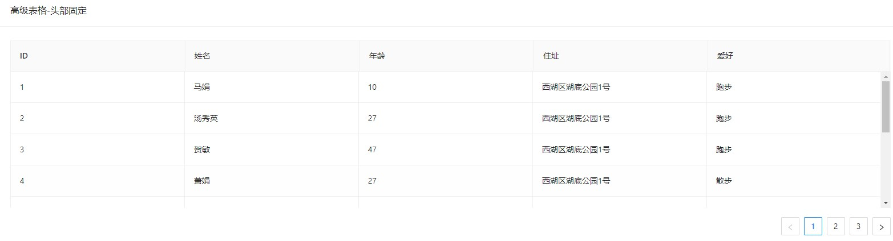

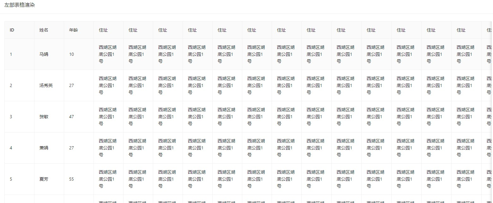

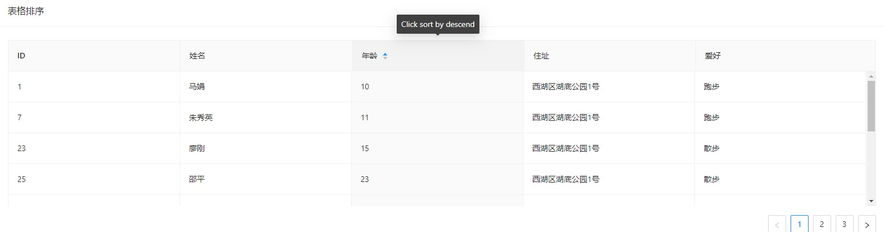

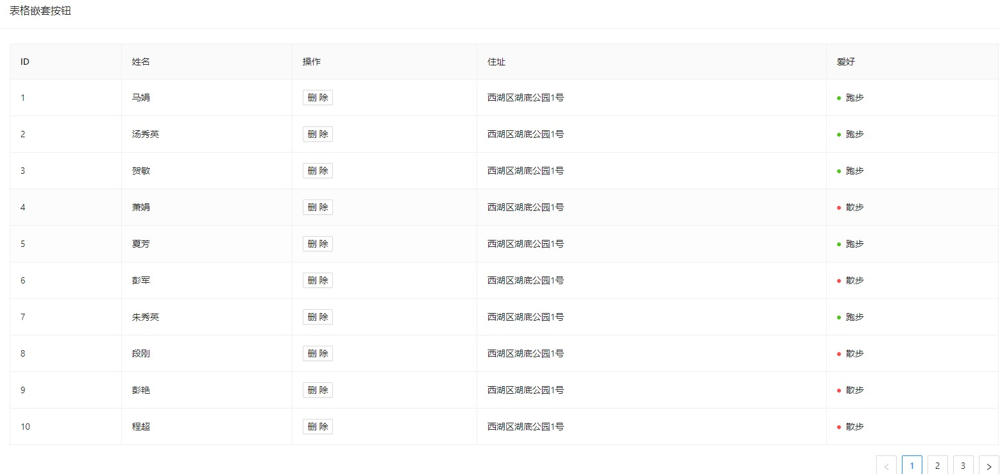

未完待续~~~~