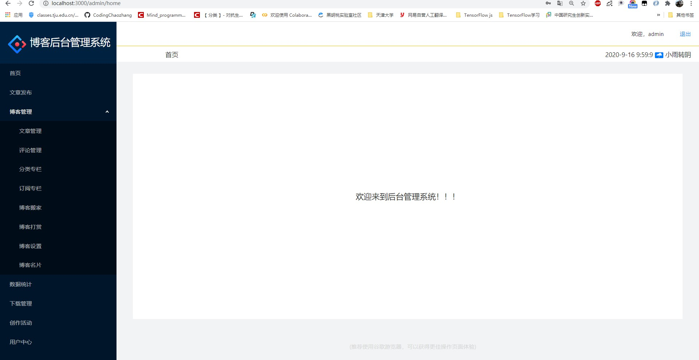
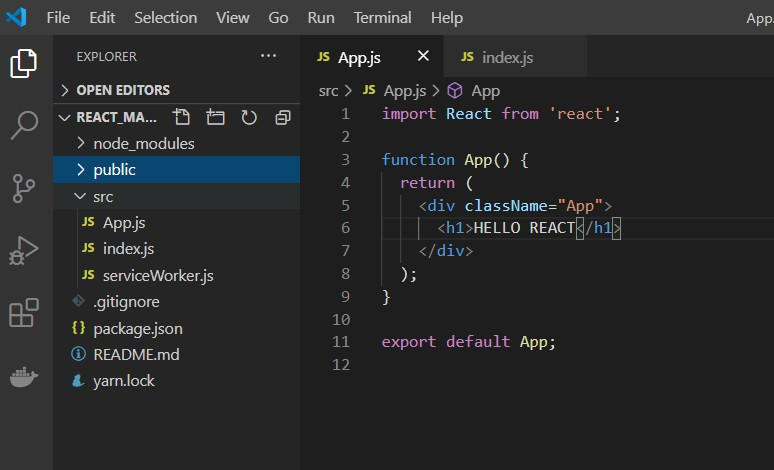
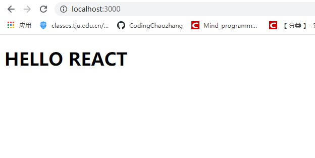
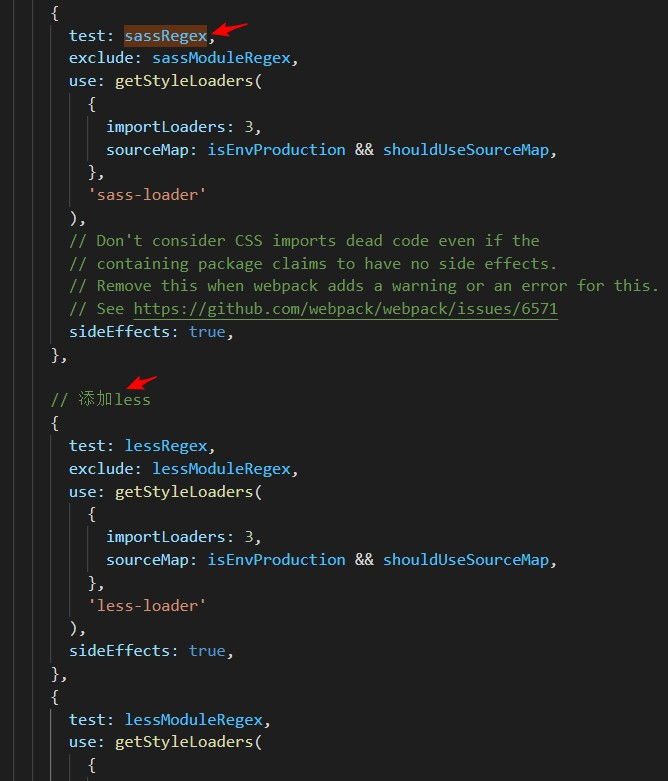
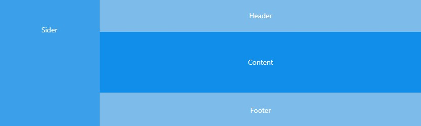
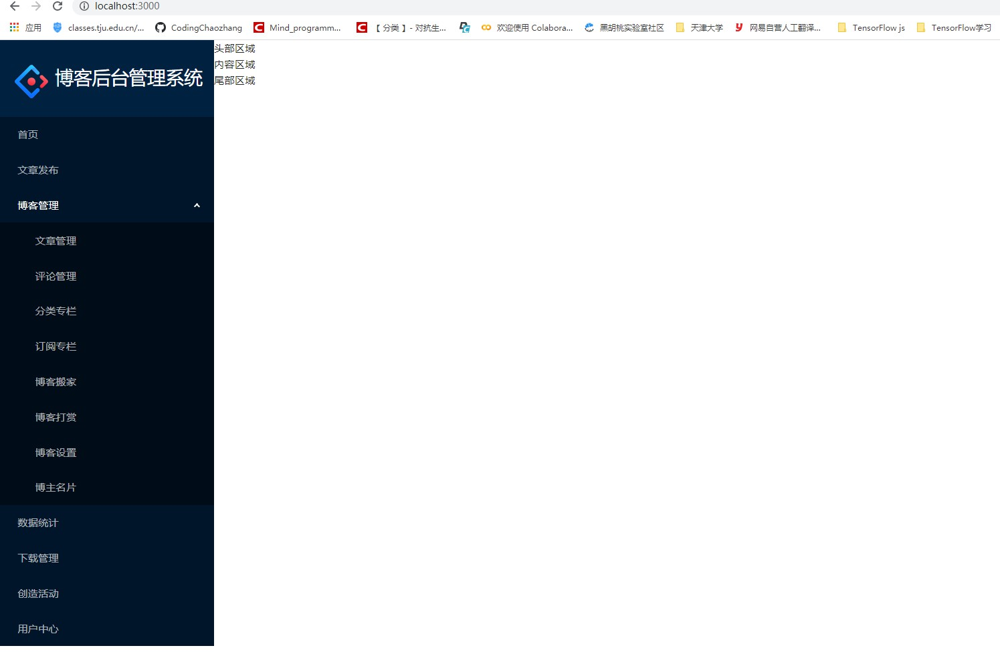
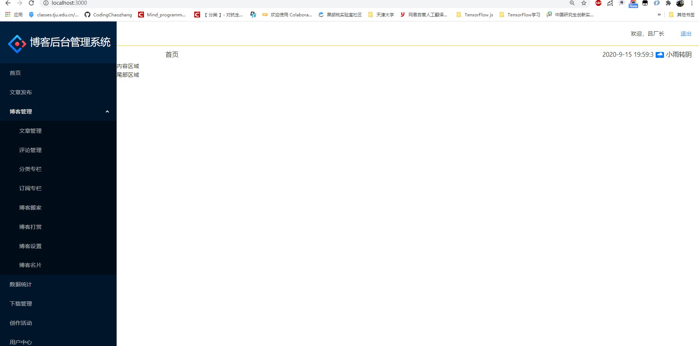

#  React后台管理系统模板





## 一、准备React

### 1.建立react应用

```shell
npx create-react-app  react_management_system_template
cd react_management_system_template
```

并对react应用进行整理，整理成如下图所示



在terminal中输入`yarn start`，在游览器中输入`http://localhost:3000`即可得到如下图：



### 2.基础插件安装

本次所需的插件

- react-router-dom 
- less less-loader
- axios
- jsonp
- antd

`yarn add react-router-dom axios less less-loader@4.0.1 antd `


### 3.暴露webpack

- `yarn eject` 


### 4.项目使用Less

在上述暴露出webpack的基础上，找到`config/webpack.config.js`文件。

加上这两句


之后找到`getStyleLoaders`方法，添加代码如图所示


最后找到如下代码处，添加less支持



```js
// 添加less
            {
              test: lessRegex,
              exclude: lessModuleRegex,
              use: getStyleLoaders(
                {
                  importLoaders: 3,
                  sourceMap: isEnvProduction && shouldUseSourceMap,
                },
                'less-loader'
              ),
              sideEffects: true,
            },
            {
              test: lessModuleRegex,
              use: getStyleLoaders(
                {
                  importLoaders: 3,
                  sourceMap: isEnvProduction && shouldUseSourceMap,
                  modules: {
                    getLocalIdent: getCSSModuleLocalIdent,
                  },
                },
                'less-loader'
              ),
            },
```

之后在项目中新建App.less文件测试less文件是否可用正常使用。


并在App.js中引入App.less之后`yarn start`启动项目，可用看到背景正常设置为红色，设置成功！


## 二、项目主页开发

### 1.项目主页设置

本次以博客管理系统为例。下面对管理系统页面结构定义：

- 页面结构定义
  - 左侧 列表模块
  - 右侧
    - 头部模块
    - 内容页面
    - 尾部模块



### 2.主页简约配置

主页采用`Antd`的`Grid栅格`(https://ant.design/components/grid-cn/)

`记得在index.js中引入antd.css，否则不起作用，即import 'antd/dist/antd.css';`

- 新建`Admin.js`,并搭建简约框架

```js
import React from 'react';
import {Col,Row} from 'antd';

class Admin extends React.Component {
    constructor(props) {
        super(props);
        this.state = { 

         };
    }
    render() {
        return (
            <Row className="container">
                <Col span={4} className="nav-left">
                        侧边栏
                </Col>
                <Col span={20} className="Main">
                    <Row>
                        头部区域
                    </Row>
                    <Row>
                        内容区域
                    </Row>
                    <Row>
                        尾部区域
                    </Row>
                </Col>
            </Row>
        );
    }
}

export default Admin;
```


### 3.搭建侧边栏

`参考Antd的Menu导航菜单(https://ant.design/components/menu-cn/#header)`

在`src/componets/Navleft/index.js`

```js
import React from 'react';
import { Menu } from 'antd';
import './index.less';

const { SubMenu } = Menu;

class index extends React.Component {
    constructor(props) {
        super(props);
        this.state = {  

        };
    }
    render() {
        return (
            <div>
                <div className="logo">
                    
                    <h1>博客后台管理系统</h1>   
                </div>

                <Menu theme="dark" defaultOpenKeys={['sub3']}  mode="inline">


                    <Menu.Item key="1">首页</Menu.Item>

                    <Menu.Item key="1">文章发布</Menu.Item>


                    <SubMenu key="sub3" title={"博客管理"}>
                        <Menu.Item key="1">文章管理</Menu.Item>
                        <Menu.Item key="2">评论管理</Menu.Item>
                        <Menu.Item key="3">分类专栏</Menu.Item>
                        <Menu.Item key="4">订阅专栏</Menu.Item>
                        <Menu.Item key="5">博客搬家</Menu.Item>
                        <Menu.Item key="6">博客打赏</Menu.Item>
                        <Menu.Item key="7">博客设置</Menu.Item>
                        <Menu.Item key="8">博主名片</Menu.Item>
                    </SubMenu>
                    
                    <Menu.Item key="1">数据统计</Menu.Item>

                    <Menu.Item key="1">下载管理</Menu.Item>

                    <Menu.Item key="1">创造活动</Menu.Item>


                    <Menu.Item key="1">用户中心</Menu.Item>

                </Menu>
            </div>
        );
    }
}

export default index;
```

在`src/componets/Navleft/index.less`

```css
.logo{
    line-height: 100px;
    padding-left: 20px;
    background-color: #002140;
    img{
        height: 45px;
    }
    h1{
        color: #ffffff;
        font-size: 25px;
        display: inline-block;
        vertical-align: center;
        margin: 0 0 0 10px;
    }
}
```

其效果为：



之后再对此修改，用config文件的方式来加载侧边栏

在`src/config/menuConfig.js`文件

```js
const menuList = [
    {
        title: "首页",
        key: '/admin/home'
    },
    {
        title:"文章发布",
        key: "/admin/publish_articles"
    },
    {
        title:"博客管理",
        key: "/admin/manage_blog",
        children:[
            {
                title:"文章管理",
                key:"/admin/manage_articles"
            },
            {
                title:"评论管理",
                key:"/admin/manage_comment"
            },
            {
                title:"分类专栏",
                key:"/admin/manage_column"
            },
            {
                title:"订阅专栏",
                key:"/admin/subscribe_column"
            },
            {
                title:"博客搬家",
                key:"/admin/move_blog"
            },
            {
                title:"博客打赏",
                key:"/admin/reward_blog"
            },
            {
                title:"博客设置",
                key:"/admin/setting_blog"
            },
            {
                title:"博客名片",
                key:"/admin/card"
            }
        ]
    },
    {
        title:"数据统计",
        key:"/admin/statistics"
    },
    {
        title:"下载管理",
        key:"/admin/manage_download"
    },
    {
        title:"创作活动",
        key:"/admin/activities"
    },
    {
        title:"用户中心",
        key:"/admin/user_info"
    },
];

export default menuList;
```

对之前的`NavLeft/index.js`

```js
import React from 'react';
import { Menu } from 'antd';
import './index.less';
// 引入侧边栏配置
import MenuConfig from '../../config/menuConfig';

const { SubMenu } = Menu;

class index extends React.Component {
    constructor(props) {
        super(props);
        this.state = {  

        };
    }

    // 刷新挂载组件
    componentDidMount(){
        const menuTreeNode = this.renderMenu(MenuConfig);
        this.setState({
            menuTreeNode
        })
    }

    // 菜单渲染
    renderMenu=(data)=>{
        return data.map((item)=>{
            if(item.children){
                return(
                    <SubMenu title={item.title} key={item.key}>
                        {this.renderMenu(item.children)}
                    </SubMenu>
                )
            }
            return <Menu.Item title={item.title} key={item.key}>
                        {item.title}
                   </Menu.Item>
        })
    }

    render() {
        return (
            <div>
                <div className="logo">
                    
                    <h1>博客后台管理系统</h1>   
                </div>

                <Menu theme="dark" defaultOpenKeys={['/admin/manage_blog']}  mode="inline">
                    {this.state.menuTreeNode}
                </Menu>
            </div>
        );
    }
}

export default index;
```


### 4.头部区域

头部区域分为两个部分，一部分分为用户名；另外一部分为时间和天气情况。

对时间进行格式化在`src/utils/utils.js`

```js
export default{
    formateDate(time){
        if(!time)
            return '';
        let date = new Date(time);
        return date.getFullYear() + "-" + (date.getMonth()+1) + "-" + date.getDate() + " " + date.getHours() + ":" + date.getMinutes() + ":" + date.getSeconds();
    }
}
```

对百度天气api请求的封装在`src/axios/index.js`

```js
import JsonP from 'jsonp';

export default class Axios{
    static jsonp(options){
        return new Promise((resolve,reject)=>{
            JsonP(options.url,{
                param:'callback'
            },function(err,response){
                if(response.status=='success'){
                    resolve(response);
                }else{
                    reject(response.message);
                }
            })
        })
    }
}
```

其头部为`src/components/Header/index.js`

```js
import React from 'react';
import {Col,Row} from 'antd';
import './index.less'
import Util from '../../utils/utils';
import axios from '../../axios';

class index extends React.Component {
    constructor(props) {
        super(props);
        this.state = { 
            userName:"吕厂长"
         };
    }
    // 获取时间
    componentDidMount(){
        setInterval(()=>{
            let sysTime = Util.formateDate(new Date().getTime());
            this.setState({
                sysTime
            })
        },1000)
        
        this.getWeatherApiData();
    }

    // 获取天气
    getWeatherApiData(){
        let city = "天津";
        axios.jsonp({
            url:"http://api.map.baidu.com/telematics/v3/weather?location="+encodeURIComponent(city)+"&output=json&ak=3p49MVra6urFRGOT9s8UBWr2"
        }).then((res)=>{
            if(res.status=='success'){
                let data = res.results[0].weather_data[0];
                this.setState({
                    dayPictureUrl:data.dayPictureUrl,
                    weather:data.weather
                })
            }
        })
    }

    render() {
        return (
            <div className="header">
                <Row className="header-top">
                    <Col span="24">
                        <span>欢迎，{this.state.userName}</span>
                        <a href="#">退出</a>
                    </Col>
                </Row>
                
                <Row className="breadcrumb">
                    <Col span="4" className="breadcrumb-title">
                        首页
                    </Col>
                    <Col span="20" className="breadcrumb-detail">
                        <span className="date">{this.state.sysTime}</span>
                        <span className="weather-img">
                            
                        </span>
                        <span className="weather-detail">{this.state.weather}</span>
                    </Col>
                </Row>
            </div>
        );
    }
}

export default index;
```

其目前的效果展示为：



### 5.尾部区域

尾部区域在`src/components/Footer/index.js`

```js
import React from 'react';
import './index.less';

class index extends React.Component {
    constructor(props) {
        super(props);
        this.state = { 

         };
    }
    render() {
        return (
            <div className="fonter">
                (推荐使用谷歌游览器，可以获得更佳操作页面体验)
            </div>
        );
    }
}

export default index;
```

样式文件在`src/componets/Footer/index.less`

```js
.fonter{
    padding:40px 0;
    text-align: center;
    columns: #d7d7d7;
    height: 50px;
    position: absolute;
    bottom: 10px;
    left: 40%;
}
```

### 6.首页区域

在`src/pages/home/index.js`

```js
import React from 'react';
import './index.less';
import {Row} from 'antd';

class index extends React.Component {
    constructor(props) {
        super(props);
        this.state = { 

         };
    }
    render() {
        return (
            <Row className="home-wrap" justify="center">
                欢迎来到后台管理系统!!!
            </Row>
        );
    }
}

export default index;
```

`src/pages/home/index.less`

```js
.home-wrap{
    height: calc(72vh);
    width: 95%;
    position: absolute;
    margin-top: 25px;
    background-color: white;
    align-items: center;
    justify-content: center;
    font-size: 20px;
}
```


##  三、项目添加路由

在`src/IRouter.js`

```js
import React from 'react';
import {BrowserRouter,Switch,Route} from 'react-router-dom';
import App from './App';
import Admin from './Admin';
import Home from './pages/home';
import NotMatch from './pages/NotMatch';

class IRouter extends React.Component {
    constructor(props) {
        super(props);
        this.state = {  

        };
    }
    render() {
        return (
            <BrowserRouter>
                <App>
                    <Route path="/admin" render={()=>
                        <Admin>
                            <Switch>
                                <Route path="/admin/home">
                                    <Home/>
                                </Route>
                                <Route >
                                    <NotMatch/>
                                </Route>
                            </Switch>
                        </Admin>
                    }>
                    </Route>
                </App>
            </BrowserRouter>
        );
    }
}

export default IRouter;
```

具体路由配置可看

[链接]: https://blog.csdn.net/Mind_programmonkey/article/details/108569707

## 四、项目添加用户登录 退出功能

首先参考`Antd中表单中的登录框`来绘制本次后台管理系统的登录界面。

在`src/pages/login/index.js`中绘制登录框，并对提交信息进行简单的表单验证，并将信息存入localstorage中。

```js
import React from 'react';
import './index.less';
import { UserOutlined, LockOutlined } from '@ant-design/icons';
import { Row,Col,Form, Input, Button, Checkbox } from 'antd';
import util from '../../utils/utils';
import {withRouter} from 'react-router-dom';

class index extends React.Component {
    constructor(props) {
        super(props);
        this.state = { 
            username:'',
            password:'',
            redirect:'/admin/home'
         };
    }

    // 获取输入框的信息
    onInputChange=(e)=>{
        let inputname = e.target.name;
        let inputvalue = e.target.value;
       
        this.setState({
            [inputname]:inputvalue
        })
    }

    onSubmit=()=>{
        // 登录信息
        let logInfo={
            username:this.state.username,
            password:this.state.password
        };

        // 表单验证
        let checkResult = util.checkInfo(logInfo);
        
        // 判断表单验证结果
        if(checkResult === 'success'){
            // localstorage存取
            util.setStorage('userInfo',logInfo);
            // 推往主页
            this.props.history.push(this.state.redirect);
        }else{
            alert("账户和密码输入有误!请重新输入！");
        }
    }

    render() {
        return (
         
            <Row className="login" justify="center" align="middle"	>
                <Col span={8}>
                    <h1>欢迎登录后台管理系统</h1>
                    <Form className="login-form" initialValues={{ remember: true }}>
                        <Form.Item name="username" rules={[{ required: true, message: '请输入用户名!!!' }]}>
                            <Input name="username" prefix={<UserOutlined className="site-form-item-icon" />} placeholder="请输入用户名" onChange={this.onInputChange} />
                        </Form.Item>

                        <Form.Item  name="password" rules={[{ required: true, message: '请输入密码!!!' }]}>
                            <Input name="password" prefix={<LockOutlined className="site-form-item-icon" />}type="password" placeholder="请输入密码" onChange={this.onInputChange} />
                        </Form.Item>

                        <Form.Item>
                            <Form.Item name="remember" valuePropName="checked" noStyle>
                                <Checkbox>记住用户和密码</Checkbox>
                            </Form.Item>
                            <a className="login-form-forgot" >
                                忘记密码
                            </a>
                        </Form.Item>

                        <Form.Item>
                            <Button type="primary" htmlType="submit" className="login-form-button" onClick={this.onSubmit} >
                                登录
                            </Button>
                        </Form.Item>
                    </Form>
                </Col>
            </Row>
        );
    }
}

export default withRouter(index);
```

具体的有关localstorage的存取的操作见`src/utils/utils`

```js
export default{
    // 规范化时间格式
    formateDate(time){
        if(!time)
            return '';
        let date = new Date(time);
        return date.getFullYear() + "-" + (date.getMonth()+1) + "-" + date.getDate() + " " + date.getHours() + ":" + date.getMinutes() + ":" + date.getSeconds();
    },
    // 简单的检查表单登录
    checkInfo(data){
        if(data.username=='admin'&data.password=='admin')
            return 'success'
        return 'faild'
    },
    // localstorage读取数据
    setStorage(name,data){
        let dataType = typeof data;

        if (dataType == 'object'){
            window.localStorage.setItem(name,JSON.stringify(data));
        }else if(['number','string','boolean'].indexOf(dataType)>=0){
            window.localStorage.setItem(name,data);
        }else{
            alert("该类型不能用于本地存储");
        }
    },

    // localstorage取数据
    getStorage(name){
        let data = window.localStorage.getItem(name)
        if(data){
            return JSON.parse(data);
        }else{
            return '';
        }
    },

    // localstorage移除数据
    removeStorage(name){
        window.localStorage.removeItem(name);
    }

}
```

